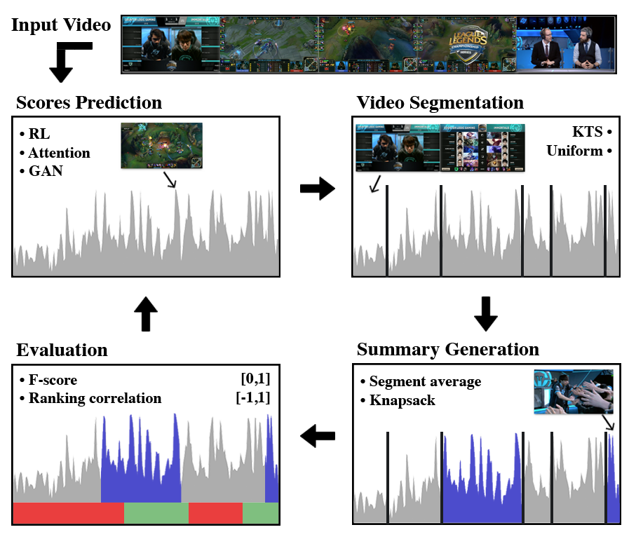
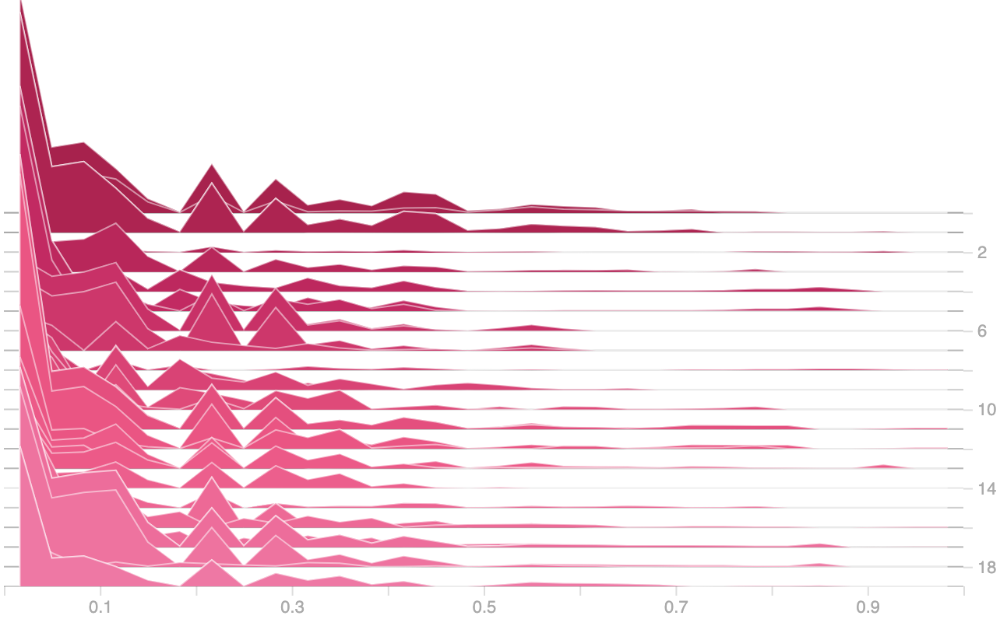
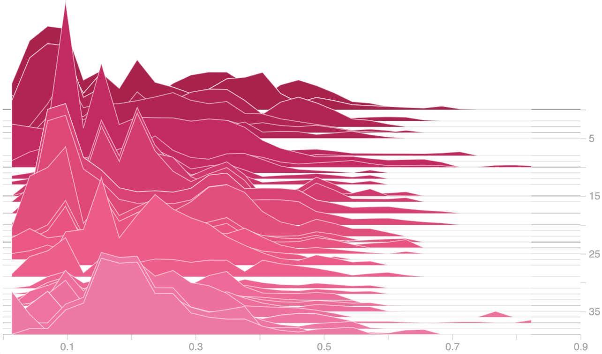
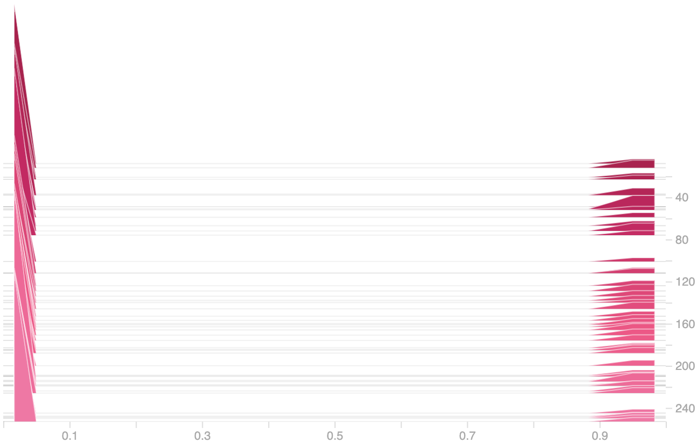

# Summarizer

Summarizer is a Video Summarization framework for research. Most of the literature now focuses on Deep Learning models experimenting on a set of reference datasets. This repository gathers the key assets to ease this research into a single Python framework.

  

The four main components are: 
* Centralized, preprocessed and documented datasets
* PyTorch implementation and bugfixes of the prominent models
* A robust set of evaluation metrics to evaluate them

This framework is dedicated at helping to design the next generation of Deep Learning models for Video Summarization.

## Datasets

SumMe                       |  TVSum                    |  LOL                      
:--------------------------:|:-------------------------:|:------------------------:
 ||

<em>Datasets ground truth scores distribution per video</em>

## Acknowledgement
The architecture of Summarizer was inspired by [K. Zhou et al.](https://github.com/KaiyangZhou/pytorch-vsumm-reinforce) and [J. Fajtl et al.](https://github.com/ok1zjf/VASNet). The preprocessed datasets were inspired by [K. Zhang et al.](https://github.com/kezhang-cs/Video-Summarization-with-LSTM). We thank them all for their leading contributions.